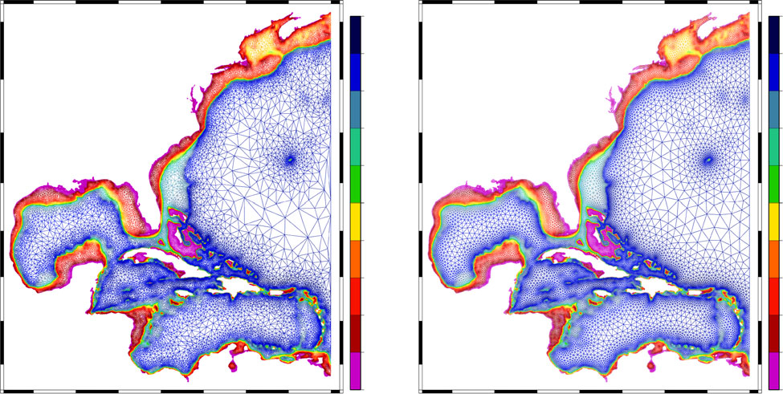

<h1 align="center">ADMESH: An ADvanced, automatic unstructured MESH generator for 2D shallow-water models.</h1>

<p align="center">
  <strong><a href="https://github.com/coltonjconroy">Colton J. Conroy</a><sup>1</sup>, <a href="https://scholar.google.com/citations?user=mYPzjIwAAAAJ&hl=en">Ethan J. Kubatko</a><sup>1</sup>, Dustin W. West<sup>1</sup></strong><br>
  <sup>1</sup>Computational Hydrodynamics and Informatics Lab (CHIL), The Ohio State University<br>
  <em>Ocean Dynamics</em> 62, 1503–1517 (2012) · <a href="https://doi.org/10.1007/s10236-012-0574-0">doi:10.1007/s10236-012-0574-0</a>
</p>

<p align="center">
  Python implementation maintained by <a href="https://scholar.google.com/citations?user=IBFSkOcAAAAJ&hl=en">Dominik Mattioli</a> (Penn State University).
</p>

<p align="center">
  <a href="https://pypi.org/project/admesh2D/"></a>
  <a href="https://www.python.org/downloads/"></a>
  <a href="LICENSE"></a>
  <a href="https://github.com/domattioli/ADMESH/releases/tag/v0.1.0"></a>
</p>

<p align="center">
  
</p>

<p align="center">
  <a href="https://pypi.org/project/admesh2D/"></a>
  
</p>

---

## Install

```bash
pip install admesh2D            # core
pip install admesh2D[viz]       # adds matplotlib for mesh.plot()
```

Or from source:

```bash
git clone https://github.com/domattioli/ADMESH.git
cd ADMESH
pip install -e ".[dev]"
```

Requires Python ≥ 3.10. Core dependencies: NumPy, SciPy, Numba, Shapely, `admesh-domains`.

---

## Quickstart

```python
import admesh

domain = admesh.load_domain_from_fort14("coast.14")
mesh = admesh.triangulate(domain)
mesh.to_fort14("out.14")
```

See [`docs/quickstart.md`](docs/quickstart.md) for a full walk-through:
custom size-field contributions, registry loading, quality gates,
pre-quad smoothing, valence balancing.

`mesh` is a frozen `Mesh` dataclass — typed nodes, elements, boundary
segments (with `BoundaryType` codes), and per-element quality.

### Round-trip with ADCIRC `fort.14`

```python
mesh = admesh.read_fort14("input.14")
mesh.to_fort14("output.14")
assert mesh.equals(admesh.read_fort14("output.14"))
```

### Custom size-field contribution

```python
def refine_near_breaker(pts):
    return 50.0 + 0.2 * np.abs(pts[:, 0] - 1500.0)

mesh = admesh.triangulate(domain, user_contribs=[refine_near_breaker])
```

Built-in size-field stages (curvature, medial axis, bathymetry, tide) `min`-stack identically to MATLAB. User contributions compose on top via user-chosen combiner (default elementwise minimum).

---

## Status

**0.1.0** ships the v1 Pythonic API + ADCIRC `fort.14` round-trip,
the default size-field stack (curvature + medial axis + bathymetry +
tide), the ADMESH-Domains registry adapter, the pre-quadrangulation
smoother (spec 004), and valence balancing (issue #27). 366 tests
green (358 standard + 4 Tier-1/Tier-2 slow + 4 contract); structural
validity holds on the WNAT and wetting-and-drying ADCIRC reference
fixtures. See [`docs/governance/PROJECT_PLAN.md`](docs/governance/PROJECT_PLAN.md)
for the full history and post-0.1.0 roadmap.

## Upstream

Reference MATLAB implementation = [`coltonjconroy/ADMESH`](https://github.com/coltonjconroy/ADMESH), maintained by original author. That repo may carry features beyond what this port currently covers; new functionality adopted here as it's pulled across.

## Related projects

- **[ADMESH-Domains](https://github.com/domattioli/ADMESH-Domains)** — federated registry of ADCIRC-compatible meshes (domains) for discovery, lineage tracking, community contribution. Built as companion to this library.

## Citation

> Conroy, C.J., Kubatko, E.J., West, D.W. (2012). ADMESH: an advanced, automatic unstructured mesh generator for shallow water models. *Ocean Dynamics* 62, 1503–1517. <https://doi.org/10.1007/s10236-012-0574-0>

Copy included at [`papers/Conroy-2012-ADMESH.pdf`](papers/Conroy-2012-ADMESH.pdf).

## Contact

- **Theory** (algorithm, size-field formulation, ADCIRC integration): Ethan J. Kubatko — [kubatko.3@osu.edu](mailto:kubatko.3@osu.edu)
- **Code** (this repository): Dominik Mattioli — [github.com/domattioli](https://github.com/domattioli)

## License

Apache 2.0 — see `LICENSE`.
