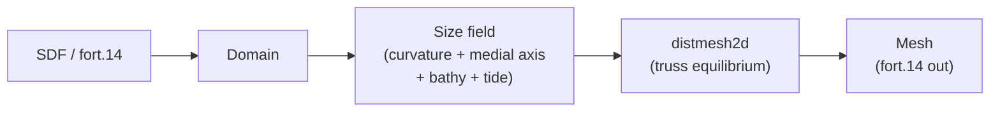

<h1 align="center">ADMESH</h1>

<p align="center">
  <strong>An ADvanced, automatic unstructured MESH generator for 2D shallow-water models.</strong><br>
  Python port of the MATLAB ADMESH library and a Pythonic API.
</p>

<p align="center">
  <strong><a href="https://scholar.google.com/citations?user=IBFSkOcAAAAJ&hl=en">Dominik Mattioli</a><sup>1†</sup>, <a href="https://scholar.google.com/citations?user=mYPzjIwAAAAJ&hl=en">Ethan Kubatko</a><sup>2</sup></strong><br>
  <sup>†</sup>Corresponding author | <sup>1</sup>Unaffiliated | <sup>2</sup>Ohio State University (CHIL)
</p>

<p align="center">
  <a href="https://pypi.org/project/admesh2D/"></a>
  <a href="https://www.python.org/downloads/"></a>
  <a href="https://github.com/domattioli/ADMESH/actions/workflows/tests.yml"></a>
  <a href="https://doi.org/10.5281/zenodo.20264101"></a>
  <a href="https://github.com/domattioli/ADMESH/issues"></a>
  <a href="LICENSE"></a>
</p>

<p align="center">
  
  <br>
  <em>A graded <a href="https://github.com/domattioli/ADMESH-Domains">Delaware Bay</a> mesh — fine in the upper river, coarse out in the open bay (<code>hmin</code>/<code>hmax</code> with gradient limit <code>g</code>) — evolving through ADMESH's pipeline: <strong>1.</strong> initialization → <strong>2.</strong> DistMesh truss solver → <strong>3.</strong> FEM smoothing. Element color tracks quality (magenta = poor → cyan = equilateral).</em>
</p>

> **Attention MATLAB users:** This Python library is the actively-developed successor to the original MATLAB codebase by [Conroy et al.](https://github.com/coltonjconroy/ADMESH) (no longer maintained). An unmaintained copy of that original ADMESH MATLAB library is kept in-repo at [`src/matlab/`](src/matlab/) for provenance. Version 1.0.0 will ship with a MATLAB wrapper of the modernized code (Est. Aug 2026).

---

## Table of Contents

- [Why ADMESH](#why-admesh)
- [Install](#install)
- [Quickstart](#quickstart)
- [Pipeline](#pipeline)
- [Performance](#performance)
- [Status & roadmap](#status--roadmap)
- [Documentation](#documentation)
- [Citation](#citation)
- [Contributing](#contributing)
- [License](#license)

---

## Why ADMESH

For shallow-water modelers who need ADCIRC-ready meshes from Python:

- **MATLAB-faithful port.** 13 stages reproduced 1:1 from the OSU CHIL Lab `01_ADMESH_Library`, with a 250+ test suite tracking numerical agreement — switching from MATLAB does not change your meshes.
- **Native ADCIRC `fort.14` I/O.** ADCIRC mesh format only (not gmsh, not generic). Bit-faithful read/mesh/write round-trip, including paired-edge records (IBTYPE 3/4/13/24).
- **Physics-driven sizing.** Element size adapts to boundary curvature, shallow channels, bathymetric gradients, and tidal wavelength via automatic `min`-stack composition. No hand-tuned scalar; custom contributions layer on top.
- **Pythonic surface, faithful internals.** `Domain` / `Mesh` / `BoundarySegment` are frozen, typed dataclasses; the numerics stay inside the locked faithful-port modules.

Not the right tool if you need 3-D, anisotropic, or non-triangular elements — use `gmsh` for those.

## Install

```bash
pip install admesh2D            # core
pip install admesh2D[viz]       # adds chilmesh for mesh.plot() / plot_quality()
```

> ⚠️ **Install `admesh2D`, not `admesh`.** `pip install admesh` pulls an
> unrelated C STL-repair library that needs `admesh/stl.h` at build time and
> will fail. This project's PyPI distribution name is **`admesh2D`**; the
> import name stays `admesh` (`import admesh`).

From source:

```bash
git clone https://github.com/domattioli/ADMESH.git
cd ADMESH
pip install -e ".[dev]"
```

Requires Python ≥ 3.10. Core deps: NumPy, SciPy, Numba, Shapely. The import name is `admesh` (the `admesh2D` on PyPI is the distribution name — the `admesh` namespace on PyPI is an unrelated STL library).

**Install hiccups** (Numba on Apple Silicon, SciPy wheels on older Python): see [open issues](https://github.com/domattioli/ADMESH/issues) and file a new one if you hit a fresh failure.

## Quickstart

```python
import admesh
from admesh import domains

# Simple domain: uniform sizing
mesh = admesh.triangulate(domains.UNIT_DISK, h_max=0.1)
mesh.to_fort14("disk.14")

# Complex domain: graded sizing (notched rectangle)
mesh = admesh.triangulate(domains.NOTCHED_RECTANGLE, h_max=0.2, h_min=0.02)
mesh.to_fort14("notched.14")
```

`mesh` is a frozen `Mesh` dataclass — typed `nodes`, `elements`, `boundaries` (each a `BoundarySegment` with a `BoundaryType` code), optional `bathymetry`, per-element `quality`.

In `triangulate`, `h_min` / `h_max` set the size bounds; pass a `size_field` callable to grade. For graded sizing, compose ADMESH's curvature + medial-axis size fields via `mesh_size.build_h()` (see `scripts/render_quickstart_notched.py` for example). See [`docs/`](docs/) for fort.14 round-trip, re-mesh, custom size-field, and SDF-domain examples.

## Performance

`triangulate(...)` runs the 13-stage ADMESH pipeline (faithful port of `01_ADMESH_Library`); the Numba-JIT solver replaces the original C MEX, so there is no compile step at install.

<p align="center">
  
  <br>
  <em>Western North Atlantic (WNAT) benchmark mesh. The size function (red = fine, blue = coarse) drives node placement; force-balance relaxation pushes element quality toward equilateral.</em>
</p>



Per-stage timings on the **WNAT** domain (144-ring Western North Atlantic coastline), all columns measured directly at `hmin=0.05` / `g=0.10`, fixed `niter=120` to isolate per-call cost. `v0.5.0` adds a Numba-JIT SDF kernel + `solve_iter` smoother; `v1.0.0` adds Triangle Delaunay + a C++ force kernel; `v1.1.0` (planned) completes the full C++ rewrite of all 13 stages.

| Algorithm step | Module | v0.2.1 | v0.5.0 (Numba) | v1.0.0 (C++ + Triangle) | v1.1.0 (Full C++ — est.) |
|---|---|---|---|---|---|
| domain load + SDF build | `distance` | 0.018 | 0.017 | 0.021 | 0.020 |
| SDF grid eval | `distance` | 1.464 | 0.271 | 0.361 | 0.240 |
| curvature | `curvature` | 0.003 | 0.003 | 0.003 | 0.003 |
| medial axis | `medial_axis` | 0.462 | 0.416 | 0.451 | 0.300 |
| grading solve | `mesh_size` | 0.496 | 0.005 | 0.005 | 0.003 |
| size-field build (subtotal) | — | 2.425 | 0.695 | 0.821 | 0.566 |
| distmesh (point gen + relax) | `distmesh` | 1255.0 | 46.5 | 25.6 | 17.1 |
| quality | `quality` | 0.009 | 0.009 | 0.008 | 0.005 |
| **TOTAL** | | **1257.5 s** | **47.2 s** | **26.4 s** | **17.6 s** |
| **Speedup vs v0.2.1** | | **1×** | **26.7×** | **47.6×** | **71.4×** |

| | v0.2.1 | v0.5.0 | v1.0.0 | v1.1.0 (Full C++) |
|---|---|---|---|---|
| nodes | 49377 | 49377 | 49192 | 49192 |
| elements | 93655 | 93642 | 93247 | 93247 |
| Min. Elem Quality | 0.038 | 0.010 | 0.050 | 0.050 |
| Mean Elem Quality | 0.963 | 0.962 | 0.963 | 0.963 |
| StDev Elem Quality | 0.055 | 0.057 | 0.054 | 0.054 |

The `v1.0.0` speedup is in `distmesh` (Triangle Delaunay 4× + C++ force kernel): the same point-placement converges 1.8× faster per call with quality holding at `mean 0.963`.

fort.14 boundary labels round-trip through `BoundaryType`, an `IntEnum` over ADCIRC `IBTYPE` codes (`OPEN=0`, `MAINLAND=1`, `ISLAND=11`, `MAINLAND_FLUX=20`); paired-edge / weir codes (3 / 4 / 13 / 24) and any unmapped code preserve as plain `int` on `BoundarySegment.bc_type`.

Reproduce or extend across new versions:

```bash
python benchmarks/compare_versions.py \
    --mesh tests/fixtures/fort14/adcirc_examples/wnat_test.14 \
    --domain benchmarks/data/wnat_onur_boundary.json \
    --ref v0.2.1="v0.2.1 (original Python)" \
    --ref current="v0.5.0 (Numba-optimized Python)" \
    --hmin 0.05 --g 0.10 --niter 120 --hist
```

Add a `--ref <tag>="<label>"` per version to compare; the table writes to `benchmarks/results/version_comparison.md`.

## Status & roadmap

- **Shipped (v0.2.1).** Pythonic API + fort.14 round-trip + 13-stage faithful port + valence balancing + custom size-field hooks. Published to [PyPI](https://pypi.org/project/admesh2D/) and archived on [Zenodo](https://doi.org/10.5281/zenodo.20264101).
- **In flight.** Spec 009 release-readiness (CI workflows, mkdocs site, stage-module reorg into `admesh/_stages/`). Spec 008 Gmsh I/O.
- **Next.** Default size-field stack consolidation; paired-edge IBTYPE 3 / 4 / 13 / 24 promoted to named `BoundaryType` members.

Open epics live as labeled issues — see [planning-required](https://github.com/domattioli/ADMESH/issues?q=is%3Aissue+label%3Aplanning-required).

## Documentation

API reference lives in the docstrings (`triangulate`, `Domain`, `Mesh`, `BoundarySegment`, `read_fort14`/`write_fort14`, and the 13 stage modules). Design notes, porting log, and domain-format specs are under [`docs/`](docs/) and [`specs/`](specs/); project invariants in [`CONSTITUTION.md`](docs/governance/CONSTITUTION.md). A hosted mkdocs site lands with spec 009.

## Citation

**Algorithm / theory** (cite the original paper):

> Conroy, C.J., Kubatko, E.J., West, D.W. (2012). ADMESH: an advanced, automatic unstructured mesh generator for shallow water models. *Ocean Dynamics* 62, 1503–1517. <https://doi.org/10.1007/s10236-012-0574-0>

**This software** (cite the archived release):

> Mattioli, D., Conroy, C.J., Kubatko, E.J., West, D.W. (2026). ADMESH: An advanced, automatic unstructured mesh generator for 2D shallow-water models (Python port). Zenodo. <https://doi.org/10.5281/zenodo.20264101>

The DOI resolves to the latest release; version-specific DOIs are on the [Zenodo record](https://doi.org/10.5281/zenodo.20264101). A [`CITATION.cff`](CITATION.cff) at the repo root feeds GitHub's "Cite this repository" button. Paper copy: [`docs/papers/Conroy-2012-ADMESH.pdf`](docs/papers/Conroy-2012-ADMESH.pdf).

## Contributing

Contributions and bug reports are welcome — open an issue or pull request on [GitHub](https://github.com/domattioli/ADMESH).

**Theory** (algorithm, size-field formulation, ADCIRC integration): Ethan J. Kubatko — [kubatko.3@osu.edu](mailto:kubatko.3@osu.edu) / **Python port** (this repository): Dominik Mattioli — [github.com/domattioli](https://github.com/domattioli)

## License

Apache 2.0 — see [`LICENSE`](LICENSE).
