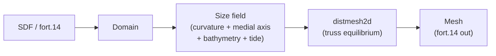

<h1 align="center">
  
</h1>

<p align="center">
  <strong>An ADvanced, automatic unstructured MESH generator for 2D shallow-water models</strong><br>
  Python API and port of the original MATLAB library

</p>

<p align="center">
  <strong><a href="https://scholar.google.com/citations?user=IBFSkOcAAAAJ&hl=en">Dominik Mattioli</a><sup>1†</sup>, Colton Conroy, Dustin West, <a href="https://scholar.google.com/citations?user=mYPzjIwAAAAJ&hl=en">Ethan Kubatko</a><sup>2</sup></strong><br>
  <sup>†</sup>Corresponding author | <sup>1</sup>Unaffiliated | <sup>2</sup>Ohio State University (<a href="https://ceg.osu.edu/computational-hydrodynamics-and-informatics-laboratory"></a>)
</p>

<p align="center">
  <a href="https://pypi.org/project/admesh2D/"></a>
  <a href="https://www.python.org/downloads/"></a>
  <a href="https://github.com/domattioli/ADMESH/actions/workflows/tests.yml"></a>
  <a href="https://github.com/domattioli/ADMESH/issues"></a>
  <a href="https://doi.org/10.5281/zenodo.20264101"></a>
  <a href="LICENSE"></a>
</p>


> **MATLAB users:** This library is the actively-developed successor to the original MATLAB codebase by [Conroy et al.](https://github.com/coltonjconroy/ADMESH) (no longer maintained). An unmaintained copy of that original is kept in-repo at [`src/matlab/`](src/matlab/) for provenance.

---

## Table of Contents

- [Status & roadmap](#status--roadmap)
- [Why ADMESH](#why-admesh)
- [Installation](#installation)
- [Quick start](#quick-start)
- [Pipeline](#pipeline)
- [Performance](#performance)
- [Citation](#citation)
- [Contributing](#contributing) · [Documentation](#documentation) · [License](#license)

---

## Status & Roadmap

**Current status (June 2026): stable and actively-maintained.** The octree adaptive background grid (`background="octree"`) refines the size field on a quadtree to better resolve medial-axis and channel feature widths.

- **Now:** address open issues.
- **Next:** enhanced pre- and post-processing for quality improvement; performance optimization; evaluate a C++ or Rust backend; parallelization.
- **Future:** formal integration within a unified ecosystem including <a href="https://github.com/domattioli/QuADMESH"></a> and <a href="https://github.com/domattioli/CHILmesh"></a>

---

## Why ADMESH

For shallow-water modelers who need ADCIRC-ready meshes with minimal user input:

- **Native ADCIRC `fort.14` I/O.** Bit-faithful read/mesh/write round-trip, including paired-edge boundary records (IBTYPE 3/4/13/24). ADCIRC format only — not gmsh, not generic.
- **Element size follows the physics.** Size adapts to boundary curvature, channel width, bathymetric gradient, and tidal wavelength through automatic `min`-stack composition; custom contributions layer on top. No hand-tuned scalar.
- **An adaptive background grid for multiscale domains.** `triangulate(background="octree")` refines the size field on a quadtree instead of a uniform grid, concentrating evaluation where the geometry demands it — opt-in; the uniform grid remains the default.
- **Pythonic surface, faithful internals.** `Domain` / `Mesh` / `BoundarySegment` are frozen, typed dataclasses; the numerics stay inside the locked faithful-port modules.

Not the right tool for 3-D, anisotropic, or non-triangular elements — use <a href="https://github.com/domattioli/QuADMESH"></a> for quads, or `gmsh` otherwise.

## Installation

```bash
pip install admesh2D            # core
pip install admesh2D[viz]       # adds chilmesh for mesh.plot() / plot_quality()
```

> ⚠️ **Install `admesh2D`, not `admesh`.** The distribution name is **`admesh2D`**; the import name stays `admesh` (`import admesh`). `pip install admesh` pulls an unrelated C STL-repair library that needs `admesh/stl.h` at build time and will fail.

Requires Python ≥ 3.10. Core dependencies: NumPy, SciPy, Numba, Shapely. From source:

```bash
git clone https://github.com/domattioli/ADMESH.git
cd ADMESH && pip install -e ".[dev]"
```

## Quick start

```python
import admesh
from admesh import domains

# Uniform sizing
mesh = admesh.triangulate(domains.UNIT_DISK, h_max=0.1)
mesh.to_fort14("disk.14")

# Graded sizing: fine features, coarse interior
mesh = admesh.triangulate(domains.NOTCHED_RECTANGLE, h_max=0.2, h_min=0.02)
mesh.to_fort14("notched.14")
```

`mesh` is a frozen `Mesh` dataclass: typed `nodes`, `elements`, `boundaries` (each a `BoundarySegment` carrying a `BoundaryType` code), optional `bathymetry`, and per-element `quality`. `h_min` / `h_max` set the size bounds; pass a `size_field` callable to grade explicitly. fort.14 boundary labels round-trip through `BoundaryType`, an `IntEnum` over ADCIRC `IBTYPE` codes (`OPEN=0`, `MAINLAND=1`, `ISLAND=11`, `MAINLAND_FLUX=20`); paired-edge and weir codes (3/4/13/24) preserve as plain `int`.

See [`docs/`](docs/) for fort.14 round-trip, re-meshing, custom size-field, and SDF-domain examples.

## Pipeline

`triangulate(...)` runs the 13-stage ADMESH pipeline; a Numba-JIT solver replaces the original C MEX, so there is no compile step at install.



## Performance

The Numba-JIT SDF kernel and `solve_iter` smoother cut end-to-end mesh generation on the Western North Atlantic benchmark from **1257.5 s to 47.2 s — a 26.7× speedup** at unchanged quality (`mean 0.963`), measured at `hmin=0.05` / `g=0.10` / `niter=120`.

| | v0.2.1 | v0.5.0 (Numba) |
|---|---|---|
| total | 1257.5 s | **47.2 s** |
| nodes / elements | 49 377 / 93 655 | 49 377 / 93 642 |
| mean element quality | 0.963 | 0.962 |

The C++ force kernel and full-stage native rewrite (v1.0.0 / v1.1.0) are in flight; the per-stage breakdown and the version-comparison harness live in [`benchmarks/`](benchmarks/results/). The forward benchmark standard is the [ENPAC 2003](https://github.com/domattioli/ADMESH-Domains) tidal database (272,913 nodes), replacing WNAT for large-domain timing.

Reproduce or extend:

```bash
python benchmarks/compare_versions.py --hist \
    --mesh tests/fixtures/fort14/adcirc_examples/wnat_test.14 \
    --domain benchmarks/data/wnat_onur_boundary.json \
    --hmin 0.05 --g 0.10 --niter 120
```

## Citation

**Algorithm** (cite the original paper):

> Conroy, C.J., Kubatko, E.J. & West, D.W. (2012). ADMESH: an advanced, automatic unstructured mesh generator for shallow water models. *Ocean Dynamics* 62, 1503–1517. <https://doi.org/10.1007/s10236-012-0574-0>

**This software** (cite the archived release):

> Mattioli, D.O., Conroy, C.J., West, D.W., Kubatko, E.J. (2026). ADMESH: An advanced, automatic unstructured mesh generator for 2D shallow-water models (Python port). Zenodo. <https://doi.org/10.5281/zenodo.20264101>

A [`CITATION.cff`](CITATION.cff) feeds GitHub's "Cite this repository" button; version-specific DOIs are on the [Zenodo record](https://doi.org/10.5281/zenodo.20264101).

## Documentation

API reference lives in the docstrings (`triangulate`, `Domain`, `Mesh`, `BoundarySegment`, `read_fort14` / `write_fort14`, the 13 stage modules). Design notes, the porting log, and domain-format specs are under [`docs/`](docs/) and [`specs/`](specs/); project invariants in [`CONSTITUTION.md`](docs/governance/CONSTITUTION.md).

## Contributing

Issues and pull requests are welcome on [GitHub](https://github.com/domattioli/ADMESH).

- **Theory** (algorithm, size-field formulation, ADCIRC integration): [Colton Conroy](https://github.com/coltonjconroy) | [Ethan Kubatko](https://ceg.osu.edu/people/kubatko.3)
- **This repository** (python port, active maintenance): [Dominik Mattioli](https://github.com/domattioli)

## License

Apache 2.0 — see [`LICENSE`](LICENSE).
