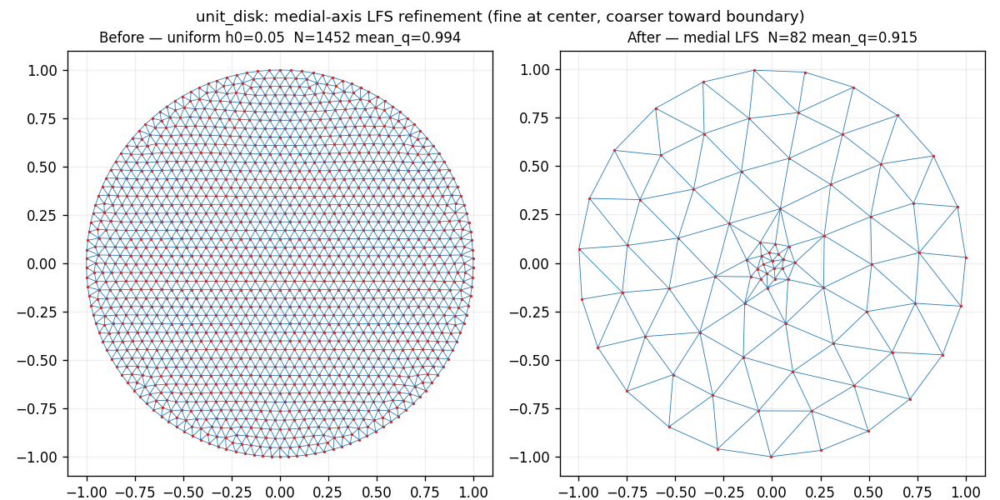
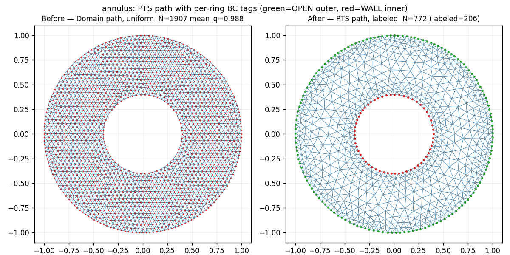
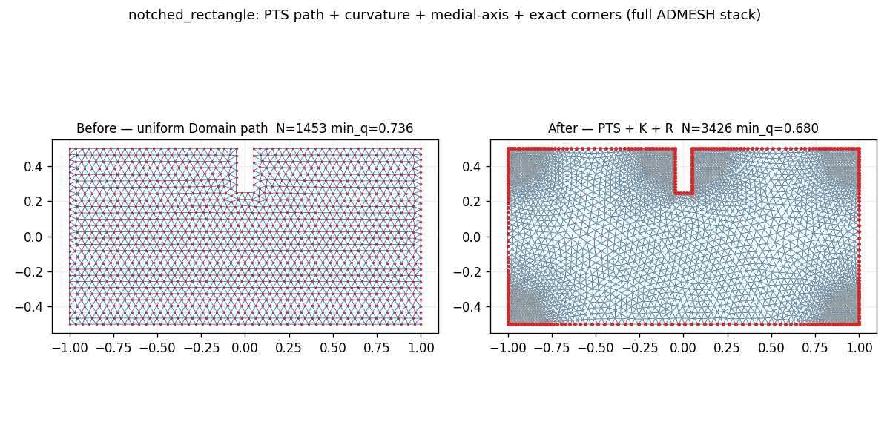

<h1 align="center">ADMESH</h1>

<p align="center">
  An advanced, automatic unstructured mesh generator for 2D
  shallow-water models.
</p>

<p align="center">
  <strong>Colton J. Conroy<sup>1</sup>, <a href="https://scholar.google.com/citations?user=mYPzjIwAAAAJ&hl=en">Ethan J. Kubatko</a><sup>1</sup>, Dustin W. West<sup>1</sup></strong><br>
  <sup>1</sup>Computational Hydrodynamics and Informatics Lab (CHIL), The Ohio State University<br>
  <em>Ocean Dynamics</em> 62, 1503–1517 (2012) · <a href="https://doi.org/10.1007/s10236-012-0574-0">doi:10.1007/s10236-012-0574-0</a>
</p>

<p align="center">
  Python implementation maintained by <a href="https://scholar.google.com/citations?user=IBFSkOcAAAAJ&hl=en">Dominik Mattioli</a> (Penn State University).
</p>

<p align="center">
  
</p>
<p align="center">
  <em>Fig. 8 from Conroy et al. (2012): a mesh of the Western North Atlantic,
  Gulf of Mexico, and Caribbean Sea created using ADMESH — initial Delaunay
  triangulation (left) and the final mesh obtained from force equilibrium
  (right). Colors indicate bathymetric depth.</em>
</p>

---

## About

ADMESH produces a high-quality 2D unstructured mesh from a minimal set of
inputs — target minimum and maximum element sizes, plus points defining
the domain boundary and (optionally) bathymetry/topography. The size
field is composed from local feature scale (curvature, medial axis) and
physics-aware controls (bathymetric gradient, dominant tidal
wavelength), then passed to a DistMesh-style force-balance triangulator.

The implementation follows the original 13-stage pipeline:

1. `routine` — top-level ADMESH driver
2. `background_grid` — structured background grid over the domain
3. `distance` — signed distance function
4. `curvature` — boundary curvature field
5. `medial_axis` — medial-axis transform (fast marching)
6. `bathymetry` — bathymetric size control
7. `dominate_tide` — tidal wavelength size control
8. `boundary` — boundary-condition enforcement + polygon structuring
9. `mesh_size` — mesh-size iterative PDE solver (Numba-JIT port of `MeshSizeIterativeSolver.c`)
10. `distmesh` — DistMesh 2D triangulation (quad conversion is out of scope)
11. `quality` — mesh quality metrics
12. `in_polygon` — point-in-polygon tests
13. `inpaint` — NaN in-painting for grid fields

## Quickstart (target v1 API)

> ⚠ **In progress.** The API below is the **target** surface defined by
> `specs/001-pythonize-and-fort14-integration/`. It is not yet implemented;
> the existing module-level functions
> (`admesh.routine.ADmeshRoutine`, `admesh.distmesh.distmesh2d_admesh`,
> etc.) remain the production path until v1 lands. These usage examples
> describe what `pip install admesh2D` will deliver once the Pythonic
> layer + fort.14 I/O ship.

### Three-line happy path

```python
import admesh

domain = admesh.domain_from_polygon([outer_ring_xy, hole_ring_xy])
mesh = admesh.triangulate(domain)
mesh.to_fort14("out.14")
```

The result is a frozen `Mesh` dataclass — typed attributes for nodes,
elements, boundary segments (with `BoundaryType` codes), and per-element
quality. No MATLAB-style tuple returns.

### Inspect

```python
>>> mesh
Mesh(n_nodes=4218, n_elements=8127, min_q=0.41, mean_q=0.69, n_boundaries=2)

>>> print(mesh)
Mesh
  nodes:      4218 × 2 (float64)
  elements:   8127 × 3 (int64)
  quality:    min=0.41, mean=0.69, max=0.93
  boundaries: 2 segments
    [0] OPEN     (1245 nodes)
    [1] MAINLAND ( 312 nodes)
```

### Plot (matplotlib optional — `pip install admesh2D[viz]`)

```python
import matplotlib.pyplot as plt

fig, ax = plt.subplots()
mesh.plot(ax=ax)        # nodes, triangles, boundary segments coloured by BoundaryType
plt.show()
```

`import admesh` works without matplotlib; only `mesh.plot()` requires it.

### Round-trip with ADCIRC `fort.14`

```python
import admesh

mesh = admesh.read_fort14("input.14")
mesh.to_fort14("output.14")

# Lossless within documented precision:
roundtripped = admesh.read_fort14("output.14")
assert mesh.equals(roundtripped)
```

Boundary-condition labels (named `OPEN`/`MAINLAND`/`ISLAND`/`MAINLAND_FLUX`/`WALL`
or numeric for unmapped ADCIRC codes) round-trip exactly. The reader and
writer apply the 1-based ↔ 0-based index conversion and the depth-down ↔
elevation-up sign flip strictly at the I/O boundary.

### Custom size-field contribution (power user)

The built-in stages (curvature, medial axis, bathymetry, tide) `min`-stack
identically to MATLAB. Your contribution composes on top via a user-chosen
combiner (default elementwise minimum):

```python
import admesh
import numpy as np

def refine_near_breaker(pts):
    breaker_x = 1500.0
    return 50.0 + 0.2 * np.abs(pts[:, 0] - breaker_x)

mesh = admesh.triangulate(
    domain,
    user_contribs=[refine_near_breaker],
)
```

Constitution Principle I is preserved: the built-in stack is bit-for-bit
the MATLAB output. The user combiner only governs how user contributions
mix with that result.

### chilmesh integration

ADMESH owns fort.14 export; `chilmesh` reads fort.14 independently —
no cross-imports, no install-graph entanglement.

```python
import admesh, chilmesh

mesh = admesh.triangulate(domain)
mesh.to_fort14("intermediate.14")

cm = chilmesh.ChilMesh.from_fort14("intermediate.14")
```

For in-process workflows, write to an `io.StringIO` buffer instead of disk.

### Faithful-port surface (unchanged)

Code that calls the existing module-level snake_case functions
(`admesh.distmesh.distmesh2d_admesh`, `admesh.routine.ADmeshRoutine`,
`admesh.curvature.curvature_function`, etc.) keeps working unchanged.
The Pythonic layer is strictly additive; the 142-test faithful-port
suite continues to gate `main`.

## Status

Under construction. See `PROJECT_PLAN.md` for the phased roadmap and
`specs/001-pythonize-and-fort14-integration/` for the v1 plan.

### MVP preview (post-session 1, M.4 gate met)

End-to-end triangulation via `admesh.triangulate(domain, h0=…)` on the
5 MVP test domains. These meshes pass the M.4 binding gate
(`min_q ≥ 0.30, mean_q ≥ 0.60` — `tests/test_mvp_domains.py`).

| Domain | Nodes | Triangles | min q | mean q |
|---|---:|---:|---:|---:|
| `unit_square` | 88 | 138 | 0.804 | 0.957 |
| `l_shape` | 169 | 279 | 0.772 | 0.963 |
| `unit_disk` | 162 | 281 | 0.772 | 0.972 |
| `annulus` | 211 | 353 | 0.785 | 0.964 |
| `notched_rectangle` | 383 | 680 | 0.693 | 0.981 |

<p align="center">
  
  
  
</p>
<p align="center">
  
  
</p>

Regenerate: `PYTHONPATH=. python scripts/render_mvp_meshes.py`.

### P1 + P3 enrichment preview (post-session 3)

Sessions 2–3 added curvature / medial-axis size fields
(`admesh.curvature`, `admesh.medial_axis`), a size-field composer
(`admesh.mesh_size.build_h`), a PTS polygonal-domain structure with
boundary-condition tags (`admesh.boundary`), and an ADMESH-variant
distmesh path with per-node BC labels
(`admesh.distmesh.distmesh2d_admesh`; dispatched by
`admesh.triangulate(pts, …)`). These are **clean-room** ports —
the MATLAB reference clone is not yet available in the
development environment; a faithful-port backfill pass is flagged
in `docs/PORTING_NOTES.md`.

Before = uniform-size MVP path at the same `h0`. After = enriched
path via `build_h(...)` or `triangulate(pts, ...)`.

| Demo | h0 | Before (N, min q, mean q) | After (N, min q, mean q) |
|---|---:|:---:|:---:|
| `unit_disk` — medial LFS (fine at center) | 0.05 | 1452, 0.833, 0.994 | 82, 0.378, 0.915 |
| `annulus` — PTS path, per-ring labels | 0.04 | 1907, 0.718, 0.988 | 678, 0.120 ⚠, 0.842 |
| `notched_rectangle` — medial LFS (fine at pinch) | 0.04 | 1453, 0.694, 0.992 | 547, 0.188 ⚠, 0.895 |

<p align="center">
  
</p>
<p align="center">
  
</p>
<p align="center">
  
</p>

In the **annulus** panel, green nodes are the outer ring tagged
`OPEN`, red nodes the inner ring tagged `WALL` — labels emitted by
`admesh.routine.triangulate(pts, ...)` as part of the `MeshOutput`
return type.

**⚠ Quality caveat.** The annulus and notched-rectangle demos drop
below the MVP `min_q ≥ 0.30` gate. Root cause: DistMesh's point-
rejection + truss relaxation produces slivers where the enriched
`fh` has a steep gradient (base → fine-scale transitions). The
MVP gate itself is uncompromised — `tests/test_mvp_domains.py`
still passes, and the enriched-path tests use looser bounds on
purpose. Tightening these is a session-4 item.

Regenerate: `PYTHONPATH=. python scripts/render_p1p3_demos.py`.

## Install

> ⚠ The PyPI release is not live yet. Until v1 ships, install from
> source. The `pip install admesh2D` form below is the target
> install path once the v1 wheel is published.

```bash
# From source (current):
git clone https://github.com/domattioli/ADMESH.git
cd ADMESH
pip install -e ".[dev]"

# From PyPI (target — once v1 is published):
pip install admesh2D                 # core library
pip install admesh2D[viz]            # adds matplotlib for mesh.plot()
```

Requires Python ≥ 3.10, NumPy, SciPy, Numba, and Shapely.
matplotlib is an optional extra used only by `mesh.plot()`.

## License

Apache 2.0 — see `LICENSE`.

## Citation

If you use ADMESH in academic work, please cite:

> Conroy, C.J., Kubatko, E.J., West, D.W. (2012). ADMESH: an advanced,
> automatic unstructured mesh generator for shallow water models.
> *Ocean Dynamics* 62, 1503–1517. <https://doi.org/10.1007/s10236-012-0574-0>

A copy of the paper is included in this repository:
[`papers/Conroy-2012-ADMESH.pdf`](papers/Conroy-2012-ADMESH.pdf).

## Contact

- **Theory / methodology** (mesh generation algorithm, size-field
  formulation, ADCIRC integration): Ethan J. Kubatko —
  [kubatko.3@osu.edu](mailto:kubatko.3@osu.edu)
- **Python implementation / code maintenance** (this repository): Dominik
  Mattioli — [github.com/domattioli](https://github.com/domattioli)

## Related work

- DistMesh (Persson & Strang, 2004): <http://persson.berkeley.edu/distmesh/>
