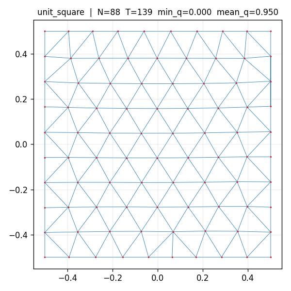
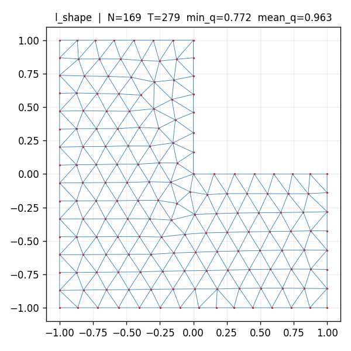
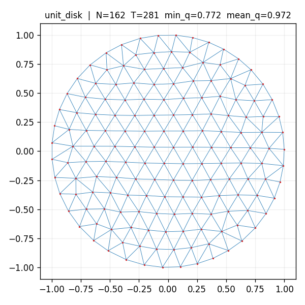
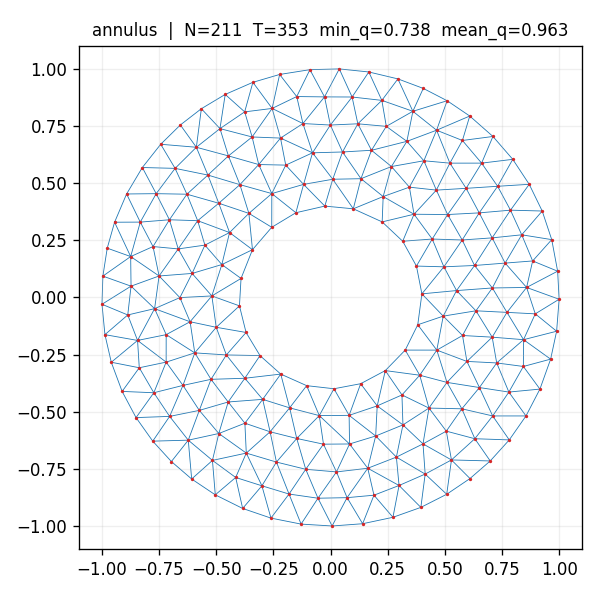
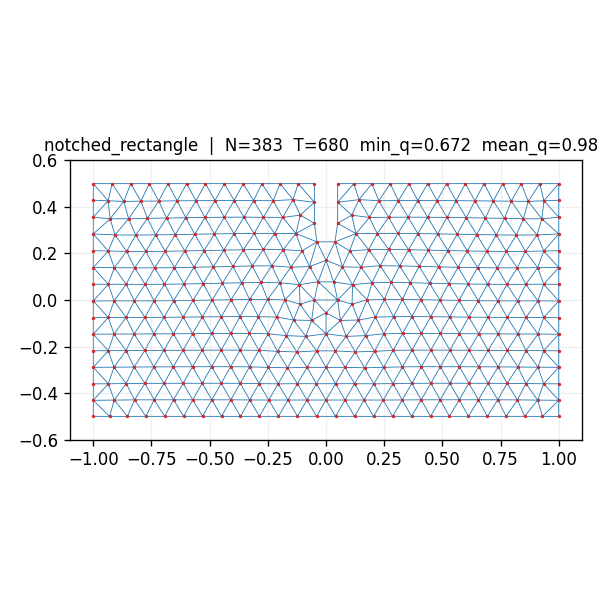

<h1 align="center">ADMESH</h1>

<p align="center">
  Python port of the ADMESH library — an advancing-front / distance-driven
  unstructured mesh generator for 2D shallow-water (ADCIRC-style) domains.
</p>

<p align="center">
  <strong><a href="https://scholar.google.com/citations?user=IBFSkOcAAAAJ&hl=en">Dominik Mattioli</a><sup>1†</sup>, <a href="https://scholar.google.com/citations?user=mYPzjIwAAAAJ&hl=en">Ethan Kubatko</a><sup>2</sup></strong><br>
  <sup>†</sup>Corresponding author<br>
  <sup>1</sup>Penn State University &nbsp;·&nbsp; <sup>2</sup>Computational Hydrodynamics and Informatics Lab (CHIL), The Ohio State University
</p>

---

## About

ADMESH is a faithful Python port of the MATLAB `01_ADMESH_Library`
module from [`domattioli/QuADMesh-MATLAB`](https://github.com/domattioli/QuADMesh-MATLAB)
(pinned source commit: `19b2eb9`).

The port preserves the original 13-stage pipeline:

1. `routine` — top-level ADMESH driver
2. `background_grid` — structured background grid over the domain
3. `distance` — signed distance function
4. `curvature` — boundary curvature field
5. `medial_axis` — medial-axis transform (fast marching)
6. `bathymetry` — bathymetric size control
7. `dominate_tide` — tidal wavelength size control
8. `boundary` — boundary-condition enforcement + polygon structuring
9. `mesh_size` — mesh-size iterative PDE solver (Numba-JIT port of `MeshSizeIterativeSolver.c`)
10. `distmesh` — DistMesh 2D triangulation (quad conversion is out of scope)
11. `quality` — mesh quality metrics
12. `in_polygon` — point-in-polygon tests
13. `inpaint` — NaN in-painting for grid fields

## Status

Under construction. See `PROJECT_PLAN.md` for phased roadmap.

### MVP preview (post-session 0)

End-to-end triangulation via `admesh.triangulate(domain, h0=…)` on the
5 MVP test domains. Formal M.4 gate (session 1) will add pytest
assertions on quality + completion; these PNGs are a visual sanity
check of the current pipeline.

| Domain | Nodes | Triangles | mean q |
|---|---:|---:|---:|
| `unit_square` | 88 | 139 | 0.950 |
| `l_shape` | 169 | 279 | 0.963 |
| `unit_disk` | 162 | 281 | 0.972 |
| `annulus` | 211 | 353 | 0.963 |
| `notched_rectangle` | 383 | 680 | 0.981 |

<p align="center">
  
  
  
</p>
<p align="center">
  
  
</p>

Regenerate: `PYTHONPATH=. python scripts/render_mvp_meshes.py`.

## Install

```bash
pip install -e .
```

Requires Python ≥ 3.10, NumPy, SciPy, and Numba.

## License

Apache 2.0 — see `LICENSE`.

## Related work

- Original MATLAB implementation: [`domattioli/QuADMesh-MATLAB`](https://github.com/domattioli/QuADMesh-MATLAB)
- DistMesh (Persson & Strang, 2004): <http://persson.berkeley.edu/distmesh/>
