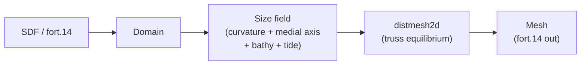

<h1 align="center">ADMESH</h1>

<p align="center">
  <strong>An ADvanced, automatic unstructured MESH generator for 2D shallow-water models.</strong><br>
  Python port of the MATLAB ADMESH library and a Pythonic API.
</p>

<p align="center">
  <strong><a href="https://scholar.google.com/citations?user=IBFSkOcAAAAJ&hl=en">Dominik Mattioli</a><sup>1†</sup>, <a href="https://scholar.google.com/citations?user=mYPzjIwAAAAJ&hl=en">Ethan Kubatko</a><sup>2</sup></strong><br>
  <sup>†</sup>Corresponding author | <sup>1</sup>Unaffiliated | <sup>2</sup>Ohio State University (CHIL)
</p>

<p align="center">
  <a href="https://pypi.org/project/admesh2D/"></a>
  <a href="https://www.python.org/downloads/"></a>
  <a href="https://github.com/domattioli/ADMESH/actions/workflows/tests.yml"></a>
  <a href="https://doi.org/10.5281/zenodo.20264101"></a>
  <a href="https://github.com/domattioli/ADMESH/issues"></a>
  <a href="LICENSE"></a>
</p>

<p align="center">
  
  <br>
  <em>The size function (red = fine, blue = coarse) drives node placement; force-balance relaxation pushes element quality toward equilateral.</em>
</p>

> **Attention MATLAB users:** This Python library is the actively-developed successor to the original MATLAB codebase by [Conroy et al.](https://github.com/coltonjconroy/ADMESH) (no longer maintained). An unmaintained copy of that original ADMESH MATLAB library is archived in-repo at [`archive/matlab/`](archive/matlab/) for provenance. Version 1.0.0 will ship with a MATLAB wrapper of the modernized code (Est. Aug 2026).

---

## Table of Contents

- [Why ADMESH](#why-admesh)
- [Install](#install)
- [Quickstart](#quickstart)
- [Pipeline](#pipeline)
- [Performance](#performance)
- [Status & roadmap](#status--roadmap)
- [Documentation](#documentation)
- [Citation](#citation)
- [Contributing](#contributing)
- [License](#license)

---

## Why ADMESH

For shallow-water modelers who need ADCIRC-ready meshes from Python:

- **MATLAB-faithful port.** 13 stages reproduced 1:1 from the OSU CHIL Lab `01_ADMESH_Library`, with a 250+ test suite tracking numerical agreement — switching from MATLAB does not change your meshes.
- **Native ADCIRC `fort.14` I/O.** ADCIRC mesh format only (not gmsh, not generic). Bit-faithful read/mesh/write round-trip, including paired-edge records (IBTYPE 3/4/13/24).
- **Physics-driven sizing.** Element size adapts to boundary curvature, shallow channels, bathymetric gradients, and tidal wavelength via automatic `min`-stack composition. No hand-tuned scalar; custom contributions layer on top.
- **Pythonic surface, faithful internals.** `Domain` / `Mesh` / `BoundarySegment` are frozen, typed dataclasses; the numerics stay inside the locked faithful-port modules.

Not the right tool if you need 3-D, anisotropic, or non-triangular elements — use `gmsh` for those.

## Install

```bash
pip install admesh2D            # core
pip install admesh2D[viz]       # adds matplotlib for mesh.plot()
```

From source:

```bash
git clone https://github.com/domattioli/ADMESH.git
cd ADMESH
pip install -e ".[dev]"
```

Requires Python ≥ 3.10. Core deps: NumPy, SciPy, Numba, Shapely. The import name is `admesh` (the `admesh2D` on PyPI is the distribution name — the `admesh` namespace on PyPI is an unrelated STL library).

**Install hiccups** (Numba on Apple Silicon, SciPy wheels on older Python): see [open issues](https://github.com/domattioli/ADMESH/issues) and file a new one if you hit a fresh failure.

## Quickstart

```python
import admesh
from admesh import domains

# Simple domain: uniform sizing
mesh = admesh.triangulate(domains.UNIT_DISK, h_max=0.1)
mesh.to_fort14("disk.14")

# Complex domain: adaptive grading (notched rectangle)
mesh = admesh.triangulate(domains.NOTCHED_RECTANGLE, h_max=0.2, g=0.15)
mesh.to_fort14("notched.14")
```

`mesh` is a frozen `Mesh` dataclass — typed `nodes`, `elements`, `boundaries` (each a `BoundarySegment` with a `BoundaryType` code), optional `bathymetry`, per-element `quality`. Regenerate the hero animation via `python scripts/render_annulus_animation.py` (needs `matplotlib` + `pillow`; optional `ffmpeg` for MP4).

<p align="center">
  
  <br>
  <em>Notched-rectangle domain, curvature-graded from <code>hmin=0.02</code> to <code>hmax=0.20</code>, <code>g=0.15</code> — elements refine at the sharp notch and corners, coarsen through the interior.</em>
</p>

**Domain-specific hyperparameters:**
```python
# Simple domains (convex, smooth boundaries)
admesh.triangulate(domains.ANNULUS, h_max=0.05)           # fine mesh
admesh.triangulate(domains.UNIT_DISK, h_max=0.10)

# Complex domains (sharp features, narrow channels)
admesh.triangulate(domains.NOTCHED_RECTANGLE, h_max=0.20, g=0.15)  # coarser but graded
admesh.triangulate(domains.L_SHAPE, h_max=0.08, g=0.12)
```

See [`docs/`](docs/) for fort.14 round-trip, re-mesh, custom size-field, and SDF-domain examples.

## Pipeline



Each call to `triangulate(...)` flows through the 13-stage ADMESH pipeline (faithful port of the MATLAB modules under `01_ADMESH_Library`):

| # | Stage | Module | Purpose |
|---|---|---|---|
| 1 | Distance | `admesh.distance` | Signed-distance grid from the domain SDF |
| 2 | Curvature | `admesh.curvature` | Refines near sharp boundary curvature |
| 3 | Medial axis | `admesh.medial_axis` | Adds sizing pressure in narrow channels |
| 4 | Bathymetry | `admesh.bathymetry` | Element size scales with depth gradient |
| 5 | Dominant tide | `admesh.dominate_tide` | Resolves tidal wavelength on the shelf |
| 6 | Boundary | `admesh.boundary` | Enforces BC labels at boundary edges |
| 7 | Mesh size | `admesh.mesh_size` | Numba-JIT iterative solver (`min`-stack) |
| 8 | distmesh2d | `admesh.distmesh` | Truss-equilibrium point placement |
| 9 | Quality | `admesh.quality` | Per-element shape metric, gate at q ≥ 0.3 |
| 10 | In-polygon | `admesh.in_polygon` | Winding-number containment tests |
| 11 | Inpaint | `admesh.inpaint` | Fills NaN holes in bathymetry / size grids |
| 12 | Background grid | `admesh.background_grid` | Anisotropic background field |
| 13 | Valence | `admesh.valence` | Edge-flip rebalancing (new in 0.2.0, issue #27) |

The Numba-JIT iterative solver replaces the C MEX from the MATLAB original — no compile step at install time.

`BoundaryType` is an `IntEnum` over the ADCIRC `IBTYPE` codes that the fort.14 reader/writer names. Unmapped codes round-trip as plain `int` on `BoundarySegment.bc_type`.

| Code | Name | Meaning |
|---|---|---|
| 0 | `OPEN` | Open ocean / external water |
| 1 | `MAINLAND` (alias `WALL`) | Mainland boundary, no normal flux |
| 11 | `ISLAND` | Island boundary |
| 20 | `MAINLAND_FLUX` | Mainland with specified normal flux |
| 3 / 4 / 13 / 24 | (preserved as `int`) | Paired-edge / weir-type — read and written faithfully, not yet named in the enum |
| other | (preserved as `int`) | Round-tripped, not interpreted |

```python
from admesh import BoundaryType, read_fort14

mesh = read_fort14("coast.14")
for seg in mesh.boundaries:
    if seg.bc_type == BoundaryType.ISLAND:
        ...
```

## Performance

Per-stage timings on the **WNAT (Hagen)** domain — a 144-ring Western North Atlantic coastline (Gulf of Mexico + Caribbean + US East Coast). The size-field floor `hmax=0.967` and grading `g` are seeded from the original ADCIRC mesh (`wnat_test.14`), and `hmin=0.05` / `g=0.10` is the published operating point: `hmin=0.05` resolves the small islands (e.g. Bermuda, ~0.06 wide) that the original mesh's coarser floor left as sub-resolution slivers, and `g=0.10` is the grading limit that keeps the coast→shelf transition smooth. Both columns run the identical pipeline at a fixed `niter=120` so the numbers isolate per-call cost. `v0.5.0` is still pure Python — the speedup comes from a Numba-JIT uniform-grid SDF kernel (`_fast_sdf.py`) replacing the shapely/scipy SDF, plus the Numba `solve_iter` size-field smoother.

| Algorithm step | v0.2.1 (original Python) | v0.5.0 (Numba-optimized Python) | v1.0.0alpha-preview (C++ distmesh) |
|---|---|---|---|
| domain load + SDF build | 0.018 | 0.017 | 0.017 |
| SDF grid eval (`eval_sdf_grid`) | 1.464 | 0.271 | 0.271 |
| curvature (`apply_curvature`) | 0.003 | 0.003 | 0.003 |
| medial axis (`apply_medial_axis`) | 0.462 | 0.416 | 0.416 |
| grading solve (`solve_iter`, g) | 0.496 | 0.005 | 0.005 |
| size-field build (subtotal) | 2.425 | 0.695 | 0.695 |
| distmesh (point gen + relax) | 1255.0 | 46.5 | 12.0 |
| quality (`mesh_quality`) | 0.009 | 0.009 | 0.009 |
| **TOTAL** | **1257.5 s** | **47.2 s** | **12.7 s** |

|  | v0.2.1 | v0.5.0 |
|---|---|---|
| nodes | 49377 | 49377 |
| elements | 93655 | 93642 |
| Min. Elem Quality | 0.038 | 0.010 |
| Mean Elem Quality | 0.963 | 0.962 |
| StDev Elem Quality | 0.055 | 0.057 |

Output meshes are statistically identical (same node count, same mean quality) — the optimization is speed-only. The low min-quality outlier is a geometry-inherent sliver at Bermuda, where the island is near the `hmin` floor; it does not move the mean (0.962).

Reproduce or extend across new versions:

```bash
python benchmarks/compare_versions.py \
    --mesh tests/fixtures/fort14/adcirc_examples/wnat_test.14 \
    --domain benchmarks/data/wnat_onur_boundary.json \
    --ref v0.2.1="v0.2.1 (original Python)" \
    --ref current="v0.5.0 (Numba-optimized Python)" \
    --hmin 0.05 --g 0.10 --niter 120 --hist
```

Add a `--ref <tag>="<label>"` per version to compare; the table writes to `benchmarks/results/version_comparison.md`.

## Status & roadmap

- **Shipped (v0.2.1).** Pythonic API + fort.14 round-trip + 13-stage faithful port + valence balancing + custom size-field hooks. Published to [PyPI](https://pypi.org/project/admesh2D/) and archived on [Zenodo](https://doi.org/10.5281/zenodo.20264101).
- **In flight.** Spec 009 release-readiness (CI workflows, mkdocs site, stage-module reorg into `admesh/_stages/`). Spec 008 Gmsh I/O.
- **Next.** Default size-field stack consolidation; paired-edge IBTYPE 3 / 4 / 13 / 24 promoted to named `BoundaryType` members.

Open epics live as labeled issues — see [planning-required](https://github.com/domattioli/ADMESH/issues?q=is%3Aissue+label%3Aplanning-required).

## Documentation

- API reference: docstrings on `Domain`, `Mesh`, `BoundarySegment`, `triangulate`, `read_fort14`, `write_fort14`, and the 13 stage modules.
- Architecture + porting notes: [`docs/`](docs/) (governance, persistence journal, porting notes, domain I/O).
- Specs (design + acceptance criteria for each feature): [`specs/`](specs/).
- Constitution (project principles + faithful-port invariants): [`docs/governance/CONSTITUTION.md`](docs/governance/CONSTITUTION.md).
- A mkdocs site with auto-generated API reference lands with spec 009 R3.

## Citation

**Algorithm / theory** (cite the original paper):

> Conroy, C.J., Kubatko, E.J., West, D.W. (2012). ADMESH: an advanced, automatic unstructured mesh generator for shallow water models. *Ocean Dynamics* 62, 1503–1517. <https://doi.org/10.1007/s10236-012-0574-0>

**This software** (cite the archived release):

> Mattioli, D., Conroy, C.J., Kubatko, E.J., West, D.W. (2026). ADMESH: An advanced, automatic unstructured mesh generator for 2D shallow-water models (Python port). Zenodo. <https://doi.org/10.5281/zenodo.20264101>

The DOI resolves to the latest release; version-specific DOIs are on the [Zenodo record](https://doi.org/10.5281/zenodo.20264101). A [`CITATION.cff`](CITATION.cff) at the repo root feeds GitHub's "Cite this repository" button. Paper copy: [`papers/Conroy-2012-ADMESH.pdf`](papers/Conroy-2012-ADMESH.pdf).

## Contributing

Contributions and bug reports are welcome — open an issue or pull request on [GitHub](https://github.com/domattioli/ADMESH).

**Theory** (algorithm, size-field formulation, ADCIRC integration): Ethan J. Kubatko — [kubatko.3@osu.edu](mailto:kubatko.3@osu.edu) / **Python port** (this repository): Dominik Mattioli — [github.com/domattioli](https://github.com/domattioli)

## License

Apache 2.0 — see [`LICENSE`](LICENSE).
