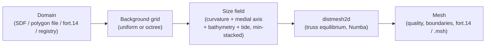

<h1 align="center">
  
</h1>

<p align="center">
  <strong>An ADvanced, automatic unstructured MESH generator for 2D shallow-water models</strong><br>
  Automatic unstructured mesh generation for shallow-water models, in Python and MATLAB

</p>

<p align="center">
  <strong><a href="https://scholar.google.com/citations?user=IBFSkOcAAAAJ&hl=en">Dominik Mattioli</a><sup>1†</sup>, Colton Conroy, Dustin West, <a href="https://scholar.google.com/citations?user=mYPzjIwAAAAJ&hl=en">Ethan Kubatko</a><sup>2</sup></strong><br>
  <sup>†</sup>Corresponding author | <sup>1</sup>Unaffiliated | <sup>2</sup>Ohio State University (<a href="https://ceg.osu.edu/computational-hydrodynamics-and-informatics-laboratory"></a>)
</p>

<p align="center">
  <a href="https://pypi.org/project/admesh2D/"></a>
  <a href="https://www.python.org/downloads/"></a>
  <a href="https://github.com/domattioli/ADMESH/actions/workflows/tests.yml"></a>
  <a href="https://github.com/domattioli/ADMESH/issues"></a>
  <a href="https://doi.org/10.5281/zenodo.21359482"></a>
  <a href="LICENSE"></a>
</p>


> **Lineage:** Two branches of ADMESH descend from the 2012 original by [Conroy et al.](https://github.com/coltonjconroy/ADMESH) The original group's current MATLAB line is **ADMESH+ v3** ([OSU-CHIL/ADMESH](https://github.com/OSU-CHIL/ADMESH); archived at [10.5281/zenodo.10242565](https://doi.org/10.5281/zenodo.10242565)), maintained by Younghun Kang with Ethan Kubatko: it adds constraint extraction for coupled 1D–2D hydrodynamic models, a revised medial-axis method, and GUI components ([Kang & Kubatko, 2024](https://doi.org/10.5194/gmd-17-1603-2024)). This repository is the parallel branch: the 2012 library in Python, with the MATLAB source alongside at [`src/matlab/`](src/matlab/).

---

## Table of Contents

1. [Status & Roadmap](#1-status--roadmap)
2. [One call turns a coastline into an ADCIRC-ready triangular mesh](#2-one-call-turns-a-coastline-into-an-adcirc-ready-triangular-mesh)
3. [Installation](#3-installation)
4. [Quick start](#4-quick-start)
5. [Public API](#5-public-api)
6. [Pipeline](#6-pipeline)
7. [Performance](#7-numba-kernels-yield-a-266-end-to-end-speedup-on-the-western-north-atlantic-benchmark)
8. [Limitations](#8-limitations)
9. [Citation](#9-citation)
10. [Documentation, Contributing, License](#10-documentation-contributing-license)

---

## 1. Status & Roadmap

**Current release: 0.6.1 (July 2026), stable and actively maintained.** 0.6.1 is a packaging patch on 0.6.0 (wheel build, CI); PyPI carries 0.6.0. 0.6.0 moved the octree adaptive background grid (`background="octree"`) into production: a vectorized quadtree refines the size field where medial-axis and channel widths demand it, and the ENPAC 2003 tidal database (272,913 nodes) replaced WNAT as the large-domain benchmark standard.

- **Now:** address open issues; evaluate techniques from ADMESH+ v3 (revised medial axis, 1D–2D constraint extraction) for adoption.
- **Next:** pre- and post-processing for quality improvement; native (C++ or Rust) kernels for the remaining hot stages; pipeline parallelization.
- **Future:** formal integration within a unified ecosystem with <a href="https://github.com/domattioli/QuADMESH"></a> (quads), <a href="https://github.com/domattioli/CHILmesh"></a> (mesh data structure and smoothing).

<div align="right"><a href="#table-of-contents"><sub>^ Back to top</sub></a></div>

## 2. One call turns a coastline into an ADCIRC-ready triangular mesh

`triangulate()` takes a domain and two edge-length bounds and returns a validated mesh. Boundary treatment and relaxation follow from the geometry; the size field is the caller's composition, uniform at `h_max` when none is supplied.

- **Physics-based sizing is opt-in.** Stage modules compute edge length from boundary curvature, channel width (medial axis), bathymetric gradient, and dominant tidal wavelength, composed through a `min` stack; `compose_size_field` adds custom callables. `triangulate` leaves that stack off by default (see [Limitations](#8-limitations)); graded sizing requires a `size_field`, `user_contribs`, or `background="octree"`.
- **Four domain sources.** `triangulate()` accepts a `Domain`, a TOML or JSON polygon file, an existing `fort.14`, or a registry slug. A legacy grid is re-meshed through `Domain.from_mesh(read_fort14(...))`.
- **Native ADCIRC and Gmsh I/O.** `fort.14` reads and writes with node ids, IBTYPE codes, and 6-decimal coordinates (`precision=` configurable); `.msh` (Gmsh 2.2 ASCII) reads and writes for non-ADCIRC solvers.
- **Adaptive background grid for multiscale domains.** `background="octree"` evaluates the size field on a 2:1-balanced quadtree in place of a uniform grid. On a flat size field the result is identical to the uniform grid; on a graded field refinement concentrates where the field changes.
- **Python and MATLAB agree.** The 13 numerical stages exist in both languages; the pytest suite pins the Python stages to MATLAB reference fixtures where the exported `.npz` is present. `Domain`, `Mesh`, and `BoundarySegment` are frozen, typed dataclasses. A Numba-JIT solver replaces the original C MEX, so installation has no compile step.

<div align="right"><a href="#table-of-contents"><sub>^ Back to top</sub></a></div>

## 3. Installation

```bash
pip install admesh2D                 # core: NumPy, SciPy, Numba, Shapely
pip install "admesh2D[viz]"          # + chilmesh for mesh.plot() / plot_quality() / plot_layers()
pip install "admesh2D[registry]"     # + huggingface_hub for on-demand registry downloads
```

> **The PyPI distribution is `admesh2D`; the import name is `admesh`.** `pip install admesh` pulls an unrelated C library for STL repair that fails to build without `admesh/stl.h`.

Requires Python 3.10 or newer. From source:

```bash
git clone https://github.com/domattioli/ADMESH.git
cd ADMESH && pip install -e ".[dev]"
```

<div align="right"><a href="#table-of-contents"><sub>^ Back to top</sub></a></div>

## 4. Quick start

```python
import admesh
from admesh import domains

# 1. Built-in domain, uniform sizing at h_max (h_min bounds any supplied size field).
mesh = admesh.triangulate(domains.NOTCHED_RECTANGLE, h_max=0.2, h_min=0.02)
mesh.to_fort14("notched.14")           # or mesh.to_msh("notched.msh")

# 2. Re-mesh an existing ADCIRC grid at a new resolution.
old = admesh.read_fort14("legacy.14")
mesh = admesh.triangulate(admesh.Domain.from_mesh(old), h_min=50.0, h_max=2000.0)

# 3. Mesh a registry domain with the adaptive background grid.
mesh = admesh.triangulate(
    admesh.load_domain_from_registry("BaranjaHill"),
    h_max=0.1, h_min=0.01, background="octree",
)
print(mesh.n_nodes, mesh.n_elements, mesh.quality.mean())
```

`mesh` is a frozen `Mesh` dataclass: `nodes`, `elements`, `boundaries` (each a `BoundarySegment` with a `BoundaryType` code), optional `bathymetry`, and per-element `quality`. `BoundaryType` is an `IntEnum` over ADCIRC `IBTYPE` codes (`OPEN=0`, `MAINLAND=1`, `ISLAND=11`, `MAINLAND_FLUX=20`); paired-edge and weir codes (3/4/13/24) pass through as plain `int`, but only the first node id of each record is kept; the paired-node and weir-height columns are dropped. Built-in domains: `UNIT_SQUARE`, `UNIT_DISK`, `L_SHAPE`, `ANNULUS`, `NOTCHED_RECTANGLE`.

<div align="right"><a href="#table-of-contents"><sub>^ Back to top</sub></a></div>

## 5. Public API

`triangulate()` is the entry point; the package also ships the surrounding workflow. Every name below is exported in `admesh.__all__`.

| Need | Call | Notes |
|---|---|---|
| Size control | `h_min`, `h_max`, `size_field=`, `user_contribs=`, `combine=` | Default is uniform at `h_max`. Stage-module contributions (curvature, medial axis, bathymetry, tide) and custom callables mapping `(N, 2)` points to edge length compose through `compose_size_field`. |
| Multiscale domains | `background="octree"` | Quadtree size-field evaluation with leaf-graph gradient limiting. Default stays `"uniform"`. |
| Reproducibility | `seed=`, `initial_points=`, `max_iter=`, `ttol=`, `dptol=` | Warm-start from a previous point set; iteration stops at `max_iter`, `dptol`, or an empty edge set. |
| Quality gate | `quality_gate=(min_q, mean_q)` | Default `(0.30, 0.60)`; raises `ValueError` when the mesh falls below it. Pass `(0.0, 0.0)` to disable. |
| ADCIRC I/O | `read_fort14`, `write_fort14`, `Mesh.to_fort14` | Round-trip of nodes, elements, and boundary segments; `Fort14ParseError` reports line, expected, actual. |
| Gmsh I/O | `read_msh`, `write_msh`, `Mesh.to_msh` | Gmsh 2.2 ASCII; boundary labels map to `BoundaryType`. |
| Domain sources | `load_domain_from_{toml,json,fort14,registry}`, `list_available_domains` | A path or slug may also be passed to `triangulate()` directly. Formats in [`docs/DOMAIN_IO.md`](docs/DOMAIN_IO.md). |
| Quality metrics | `mesh_quality`, `right_iso_quality` | Equilateral and right-isosceles targets. |
| Valence balancing | `balance_valence_triangles`, `compute_valence`, `get_valence_report` | Edge flipping toward degree-6 interior nodes, quality-guarded. |
| Quad preparation | `smooth_for_quadrangulation` | Right-isosceles smoother for downstream tri-to-quad fusion (CHILmesh, OceanMesh2D, ADCIRC v55+). |
| Plotting (`[viz]`) | `Mesh.plot`, `Mesh.plot_quality`, `Mesh.plot_layers` | Delegates to CHILmesh; returns a Matplotlib axis. |

<p align="center">
  
  <br>
  <em><code>smooth_for_quadrangulation</code> on the Block-O fixture (2,811 nodes): right-isosceles quality rises from 0.498 to 0.672 with connectivity unchanged.</em>
</p>

<div align="right"><a href="#table-of-contents"><sub>^ Back to top</sub></a></div>

## 6. Pipeline

`triangulate()` composes the stage modules below. With a `Domain` input it drives the distmesh relaxation directly and applies the size field the caller supplied. The stage modules under `admesh/_stages/` match the MATLAB library one to one and are locked; the public API composes them and never modifies them.


```mermaid
flowchart LR
    A["Domain<br>(SDF / polygon file / fort.14 / registry)"] --> B["Background grid<br>(uniform or octree)"]
    B --> C["Size field<br>(curvature + medial axis<br>+ bathymetry + tide, min-stacked)"]
    C --> D["distmesh2d<br>(truss equilibrium, Numba)"]
    D --> E["Mesh<br>(quality, boundaries, fort.14 / .msh)"]
```

<div align="right"><a href="#table-of-contents"><sub>^ Back to top</sub></a></div>

## 7. Numba kernels yield a 26.6× end-to-end speedup on the Western North Atlantic benchmark

The Numba-JIT signed-distance kernel and the `solve_iter` smoother cut end-to-end generation from **1257.5 s (v0.2.1) to 47.2 s (v0.5.0)** at `hmin=0.05`, `g=0.10`, `niter=120`; mean element quality moved from 0.963 to 0.962.

| | v0.2.1 | v0.5.0 (Numba) |
|---|---|---|
| total | 1257.5 s | **47.2 s** |
| nodes / elements | 49 377 / 93 655 | 49 377 / 93 642 |
| mean element quality | 0.963 | 0.962 |

An experimental C++ distmesh kernel (unreleased, `src/admesh/_cpp/`) runs the same case in 29.1 s in the in-repo harness; that figure is a development measurement of unreleased code. The per-stage breakdown and the version-comparison harness live in [`benchmarks/`](benchmarks/results/). The forward benchmark standard is the ENPAC 2003 tidal database (272,913 nodes).

Reproduce or extend (one `--ref <git-ref>=<label>` per column; the 0.2.1 and 0.5.0 tags are not published on this remote, so compare `v0.5.1` against the working tree or pass commit hashes):

```bash
python benchmarks/compare_versions.py --hist \
    --ref v0.5.1=v0.5.1 --ref current=dev \
    --mesh tests/fixtures/fort14/adcirc_examples/wnat_test.14 \
    --domain benchmarks/data/wnat_onur_boundary.json \
    --hmin 0.05 --g 0.10 --niter 120
```

<div align="right"><a href="#table-of-contents"><sub>^ Back to top</sub></a></div>

## 8. Limitations

- **Triangles only, in 2-D.** No quads, no 3-D, no anisotropic elements. For quads: <a href="https://github.com/domattioli/QuADMESH"></a>. For 3-D or anisotropy use Gmsh.
- **Two mesh formats.** ADCIRC `fort.14` and Gmsh 2.2 ASCII `.msh`. No SMS 2dm, no Gmsh 4.x binary, no netCDF.
- **The 2012 algorithm as published.** The 13 stage modules implement the 2012 method, including its medial-axis step. The revised medial axis and 1D–2D constraint extraction of ADMESH+ v3 ([Kang & Kubatko, 2024](https://doi.org/10.5194/gmd-17-1603-2024)) are not implemented; adoption is under evaluation.
- **Quality is parameter-driven.** `h_min`, `h_max`, and the grading rate set what the truss solver can reach; large `h_max`/`h_min` ratios lower minimum quality. `quality_gate` is a post-hoc check that raises `ValueError`; the solver does not enforce it, so loosen the gate when the parameters legitimately lower quality.
- **Default sizing is uniform.** With only `h_min`/`h_max`, `triangulate` meshes at `h_max` everywhere. The curvature, medial-axis, bathymetry, and tide contributions exist as stage modules but are not wired in as the default (issue #65); the caller composes them or selects `background="octree"`.
- **Generated meshes carry no bathymetry.** `Mesh.bathymetry` is `None` after `triangulate`; `Domain.from_mesh` re-derives boundary rings rather than preserving the source labels, and the fort.14 domain loader uses the first land segment only.
- **fort.14 fidelity is structural.** Coordinates are written to 6 decimals, and IBTYPE 3/4/13/24 paired-node and weir columns are not preserved.
- **No oscillation or stagnation detection** in the `triangulate` relaxation loop; it exits on `max_iter`, `dptol`, or an empty edge set.
- **The octree grid is opt-in and adds build cost on small uniform domains.** On a flat size field it reproduces the uniform result at higher cost; the benefit appears on multiscale fields.
- **Single-process, CPU only.** Numba accelerates the SDF kernel and the size-field solver; the distmesh relaxation dominates wall-clock on large domains and is not parallelized.
- **No graphical interface and no hosted documentation site.** The API reference lives in docstrings and under [`docs/`](docs/).

<div align="right"><a href="#table-of-contents"><sub>^ Back to top</sub></a></div>

## 9. Citation

**Algorithm** (cite the original paper):

> Conroy, C.J., Kubatko, E.J. & West, D.W. (2012). ADMESH: an advanced, automatic unstructured mesh generator for shallow water models. *Ocean Dynamics* 62, 1503–1517. <https://doi.org/10.1007/s10236-012-0574-0>

**This software** (cite the archived release):

> Mattioli, D.O., Conroy, C.J., West, D.W., Kubatko, E.J. (2026). ADMESH: An advanced, automatic unstructured mesh generator for 2D shallow-water models (Python port). Zenodo. <https://doi.org/10.5281/zenodo.20264085>

**Upstream MATLAB line** (ADMESH+, if you use or compare against it):

> Kang, Y. & Kubatko, E.J. (2024). An automatic mesh generator for coupled 1D–2D hydrodynamic models. *Geoscientific Model Development* 17, 1603–1625. <https://doi.org/10.5194/gmd-17-1603-2024>
>
> Kang, Y., Kubatko, E.J., Conroy, C.J. & West, D.W. (2023). Younghun-Kang/ADMESH: v3.0.1. Zenodo. <https://doi.org/10.5281/zenodo.10242565>

A [`CITATION.cff`](CITATION.cff) feeds GitHub's "Cite this repository" button; version-specific DOIs are on the [Zenodo record](https://doi.org/10.5281/zenodo.20264085).

<div align="right"><a href="#table-of-contents"><sub>^ Back to top</sub></a></div>

## 10. Documentation, Contributing, License

**Documentation.** API reference in the docstrings (`triangulate`, `Domain`, `Mesh`, `BoundarySegment`, the I/O functions, the 13 stage modules) and under [`docs/api/`](docs/api/). Workflow guides: [`docs/quickstart.md`](docs/quickstart.md), [`docs/DOMAIN_IO.md`](docs/DOMAIN_IO.md) (TOML, JSON, fort.14 domain formats, registry). Design notes and the porting log: [`docs/PORTING_NOTES.md`](docs/PORTING_NOTES.md), [`docs/adr/`](docs/adr/), [`DomI/specs/consumers/ADMESH/specs/`](https://github.com/domattioli/DomI/tree/development/specs/consumers/ADMESH/specs/). Project invariants: [`CONSTITUTION.md`](docs/governance/CONSTITUTION.md). Rendered examples: [`docs/gallery/`](docs/gallery/).

**Contributing.** Issues and pull requests are accepted on [GitHub](https://github.com/domattioli/ADMESH); see [`CONTRIBUTING.md`](CONTRIBUTING.md).

- **Theory** (algorithm, size-field formulation, ADCIRC integration): [Colton Conroy](https://github.com/coltonjconroy) | [Ethan Kubatko](https://ceg.osu.edu/people/kubatko.3)
- **Upstream MATLAB line** (ADMESH+ v3: 1D–2D constraints, medial axis, GUI): [Younghun Kang](https://github.com/Younghun-Kang) | [Ethan Kubatko](https://ceg.osu.edu/people/kubatko.3)
- **This repository** (Python and MATLAB, active maintenance): [Dominik Mattioli](https://github.com/domattioli)

**License.** Apache 2.0, see [`LICENSE`](LICENSE).

<div align="right"><a href="#table-of-contents"><sub>^ Back to top</sub></a></div>
