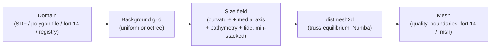

<h1 align="center">
  
</h1>

<p align="center">
  <strong>An ADvanced, automatic unstructured MESH generator for 2D shallow-water models</strong><br>
  Automatic unstructured mesh generation for shallow-water models, in Python and MATLAB

</p>

<p align="center">
  <strong><a href="https://scholar.google.com/citations?user=IBFSkOcAAAAJ&hl=en">Dominik Mattioli</a><sup>1†</sup>, Colton Conroy, Dustin West, <a href="https://scholar.google.com/citations?user=mYPzjIwAAAAJ&hl=en">Ethan Kubatko</a><sup>2</sup></strong><br>
  <sup>†</sup>Corresponding author | <sup>1</sup>Unaffiliated | <sup>2</sup>Ohio State University (<a href="https://ceg.osu.edu/computational-hydrodynamics-and-informatics-laboratory"></a>)
</p>

<p align="center">
  <a href="https://pypi.org/project/admesh2D/#history"></a>
  <a href="https://www.python.org/downloads/"></a>
  <a href="https://github.com/domattioli/ADMESH/actions/workflows/tests.yml"></a>
  <a href="https://github.com/domattioli/ADMESH/issues"></a>
  <a href="https://doi.org/10.5281/zenodo.20264085"></a>
  <a href="LICENSE"></a>
</p>


> **Lineage:** Two branches of ADMESH descend from the 2012 original by [Conroy et al.](https://github.com/coltonjconroy/ADMESH). The original group's current MATLAB line is ADMESH+ v3 ([OSU-CHIL/ADMESH](https://github.com/OSU-CHIL/ADMESH); archived at [10.5281/zenodo.10242565](https://doi.org/10.5281/zenodo.10242565)). Younghun Kang maintains it with Ethan Kubatko. It adds constraint extraction for coupled 1D–2D hydrodynamic models, a revised medial-axis method, and GUI components ([Kang & Kubatko, 2024](https://doi.org/10.5194/gmd-17-1603-2024)). This repository is the parallel branch. It holds the 2012 library in Python, with the MATLAB source alongside at [`src/matlab/`](src/matlab/).

---

## Table of Contents

1. [Status & Roadmap](#1-status--roadmap)
2. [One call turns a coastline into an ADCIRC-ready triangular mesh](#2-one-call-turns-a-coastline-into-an-adcirc-ready-triangular-mesh)
3. [Installation](#3-installation)
4. [Quick start](#4-quick-start)
5. [Public API](#5-public-api)
6. [Pipeline](#6-pipeline)
7. [Performance](#7-numba-kernels-yield-a-266-end-to-end-speedup-on-the-western-north-atlantic-benchmark)
8. [Limitations](#8-limitations)
9. [Citation](#9-citation)
10. [Documentation, Contributing, License](#10-documentation-contributing-license)

---

## 1. Status & Roadmap

**Current release: 1.0.0b1 (October 2026), beta.** The public API (`admesh.__all__`, listed in [Public API](#5-public-api)) is fixed for 1.x. The `admesh.<stage>` compatibility modules stay through 1.x and are removed no earlier than 2.0; the canonical path is `admesh._stages.<stage>`. [`CHANGELOG.md`](CHANGELOG.md) lists earlier releases.

**New in 1.0:**

1. `triangulate_batch` runs 5.1× faster on 8 workers (see [Batch meshing](#batch-meshing-runs-51-faster-on-8-workers)).
2. The domain registry reads Valence manifest schemas 0.3 and 0.4.
3. `triangulate` takes an opt-in `medial_method`: `"grid"`, `"octree"` or `"vdt"`. `"vdt"` is the vector distance transform of [Kang & Kubatko (2024)](https://doi.org/10.5194/gmd-17-1603-2024). [`benchmarks/medial_vdt.md`](benchmarks/medial_vdt.md) records why `"vdt"` stays opt-in.
4. A browser app at [admesh.domattioli.com](https://admesh.domattioli.com/) runs the ADMESH package in the page through Pyodide. Files stay on the user's computer. The documentation is at [admesh.domattioli.com/docs](https://admesh.domattioli.com/docs/).

- **Now:** the 1.0.0b1 beta, then 1.0.0; address open issues; 1D–2D internal-constraint extraction from Kang & Kubatko (2024) (#186).
- **Next:** single-mesh parallelization (#216); pre- and post-processing for quality improvement; native kernels for the remaining hot stages.
- **Future:** 3D ADMESH (#220); then formal integration within a unified ecosystem with <a href="https://github.com/domattioli/QuADMESH"></a> (quads), <a href="https://github.com/domattioli/CHILmesh"></a> (mesh data structure and smoothing).

<div align="right"><a href="#table-of-contents"><sub>^ Back to top</sub></a></div>

## 2. One call turns a coastline into an ADCIRC-ready triangular mesh

`triangulate()` takes a domain and two edge-length bounds and returns a validated mesh. Boundary treatment and relaxation follow from the geometry. The caller composes the size field. Without one, the size is uniform at `h_max`.

- **Physics-based sizing is opt-in.** Stage modules compute edge length from four inputs: boundary curvature, channel width (medial axis), bathymetric gradient, and dominant tidal wavelength. A `min` stack composes them. `compose_size_field` adds custom callables. `triangulate` leaves the stack off by default (see [Limitations](#8-limitations)). Graded sizing needs a `size_field`, `user_contribs`, or `background="octree"`.
- **Four domain sources.** `triangulate()` accepts a `Domain`, a TOML or JSON polygon file, an existing `fort.14`, or a registry slug. To re-mesh a legacy grid, use `Domain.from_mesh(read_fort14(...))`.
- **Native ADCIRC and Gmsh I/O.** The package reads and writes `fort.14` with node ids, IBTYPE codes, and 6-decimal coordinates (`precision=` is configurable). It also reads and writes `.msh` (Gmsh 2.2 ASCII) for non-ADCIRC solvers.
- **Adaptive background grid for multiscale domains.** `background="octree"` evaluates the size field on a 2:1-balanced quadtree instead of a uniform grid. The quadtree is vectorized and refines where medial-axis and channel widths demand it. On a flat size field, the result equals the uniform-grid result. On a graded field, refinement concentrates where the field changes.
- **Python and MATLAB agree.** The 13 numerical stages exist in both languages. The pytest suite pins the Python stages to MATLAB reference fixtures where the exported `.npz` is present. `Domain`, `Mesh`, and `BoundarySegment` are frozen, typed dataclasses. A Numba-JIT solver replaces the original C MEX, so installation needs no compile step.

<div align="right"><a href="#table-of-contents"><sub>^ Back to top</sub></a></div>

## 3. Installation

```bash
pip install admesh2D                 # core: NumPy, SciPy, Numba, Shapely
pip install "admesh2D[viz]"          # + chilmesh for mesh.plot() / plot_quality() / plot_layers()
pip install "admesh2D[registry]"     # + huggingface_hub for on-demand registry downloads
```

> **The PyPI distribution is `admesh2D`. The import name is `admesh`.** `pip install admesh` installs an unrelated C library for STL repair. That build fails without `admesh/stl.h`.

Requires Python 3.10 or newer. From source:

```bash
git clone https://github.com/domattioli/ADMESH.git
cd ADMESH && pip install -e ".[dev]"
```

<div align="right"><a href="#table-of-contents"><sub>^ Back to top</sub></a></div>

## 4. Quick start

```python
import admesh
from admesh import domains

# 1. Built-in domain, uniform sizing at h_max (h_min bounds any supplied size field).
mesh = admesh.triangulate(domains.NOTCHED_RECTANGLE, h_max=0.2, h_min=0.02)
mesh.to_fort14("notched.14")           # or mesh.to_msh("notched.msh")

# 2. Re-mesh an existing ADCIRC grid at a new resolution.
old = admesh.read_fort14("legacy.14")
mesh = admesh.triangulate(admesh.Domain.from_mesh(old), h_min=50.0, h_max=2000.0)

# 3. Mesh a registry domain with the adaptive background grid.
mesh = admesh.triangulate(
    admesh.load_domain_from_registry("BaranjaHill"),
    h_max=0.1, h_min=0.01, background="octree",
)
print(mesh.n_nodes, mesh.n_elements, mesh.quality.mean())

# 4. Mesh many domains at once on a process pool. Output order and results
#    match a serial loop exactly.
meshes = admesh.triangulate_batch(
    ["coast_a.json", "coast_b.json", "coast_c.json"], n_jobs=3, h_max=0.1, h_min=0.01,
)
```

`mesh` is a frozen `Mesh` dataclass. Its fields are `nodes`, `elements`, `boundaries` (each a `BoundarySegment` with a `BoundaryType` code), optional `bathymetry`, and per-element `quality`. `BoundaryType` is an `IntEnum` over ADCIRC `IBTYPE` codes (`OPEN=0`, `MAINLAND=1`, `ISLAND=11`, `MAINLAND_FLUX=20`). Paired-edge and weir codes (3/4/13/24) pass through as plain `int`. Only the first node id of each record is kept. The paired-node and weir-height columns are dropped. Built-in domains: `UNIT_SQUARE`, `UNIT_DISK`, `L_SHAPE`, `ANNULUS`, `NOTCHED_RECTANGLE`.

<div align="right"><a href="#table-of-contents"><sub>^ Back to top</sub></a></div>

## 5. Public API

`triangulate()` is the entry point. The package also ships the surrounding workflow. Every name below is exported in `admesh.__all__`.

| Need | Call | Notes |
|---|---|---|
| Size control | `h_min`, `h_max`, `size_field=`, `user_contribs=`, `combine=`, `medial_method=` | The default is uniform at `h_max`. `compose_size_field` composes stage-module contributions (curvature, medial axis, bathymetry, tide) and custom callables that map `(N, 2)` points to edge length. `medial_method` is `None` by default. It adds a channel-width contribution from one of three medial-axis methods: `"grid"`, `"octree"` or `"vdt"`. |
| Multiscale domains | `background="octree"` | Evaluates the size field on a quadtree with leaf-graph gradient limiting. The default is `"uniform"`. |
| Reproducibility | `seed=`, `initial_points=`, `max_iter=`, `ttol=`, `dptol=` | Warm-start from a previous point set. Iteration stops at `max_iter`, `dptol`, or an empty edge set. |
| Many meshes | `triangulate_batch(domains, n_jobs=None, **kwargs)` | Runs `triangulate` on a process pool and returns meshes in input order, identical to a serial loop. Parallel runs need picklable domains: paths, registry slugs, or a `Domain` with a module-level SDF. `n_jobs=1` runs in-process. |
| Quality gate | `quality_gate=(min_q, mean_q)` | The default is `(0.30, 0.60)`. A mesh below it raises `ValueError`. Pass `(0.0, 0.0)` to disable. |
| ADCIRC I/O | `read_fort14`, `write_fort14`, `Mesh.to_fort14` | Round-trips nodes, elements, and boundary segments. `Fort14ParseError` reports line, expected, actual. |
| Gmsh I/O | `read_msh`, `write_msh`, `Mesh.to_msh` | Gmsh 2.2 ASCII. Boundary labels map to `BoundaryType`. `GmshParseError` reports malformed input. |
| Domain sources | `load_domain_from_{toml,json,fort14,registry}`, `list_available_domains` | A path or slug may also be passed to `triangulate()` directly. Formats in [`docs/DOMAIN_IO.md`](docs/DOMAIN_IO.md). |
| Quality metrics | `mesh_quality`, `right_iso_quality` | Equilateral and right-isosceles targets. |
| Valence balancing | `balance_valence_triangles`, `compute_valence`, `get_valence_report` | Edge flipping toward degree-6 interior nodes, quality-guarded. |
| Quad preparation | `smooth_for_quadrangulation` | Right-isosceles smoother for downstream tri-to-quad fusion (CHILmesh, OceanMesh2D, ADCIRC v55+). |
| Plotting (`[viz]`) | `Mesh.plot`, `Mesh.plot_quality`, `Mesh.plot_layers` | Delegates to CHILmesh. Returns a Matplotlib axis. |

<p align="center">
  
  <br>
  <em><code>smooth_for_quadrangulation</code> on the Block-O fixture (2,811 nodes): right-isosceles quality rises from 0.498 to 0.672 with connectivity unchanged.</em>
</p>

<div align="right"><a href="#table-of-contents"><sub>^ Back to top</sub></a></div>

## 6. Pipeline

`triangulate()` composes the stage modules below. With a `Domain` input, it drives the distmesh relaxation directly and applies the size field the caller supplied. The stage modules under `admesh/_stages/` match the MATLAB library one to one. They are locked. The public API composes them and never modifies them.


```mermaid
flowchart LR
    A["Domain<br>(SDF / polygon file / fort.14 / registry)"] --> B["Background grid<br>(uniform or octree)"]
    B --> C["Size field<br>(curvature + medial axis<br>+ bathymetry + tide, min-stacked)"]
    C --> D["distmesh2d<br>(truss equilibrium, Numba)"]
    D --> E["Mesh<br>(quality, boundaries, fort.14 / .msh)"]
```

<div align="right"><a href="#table-of-contents"><sub>^ Back to top</sub></a></div>

## 7. Numba kernels yield a 26.6× end-to-end speedup on the Western North Atlantic benchmark

The Numba-JIT signed-distance kernel and the `solve_iter` smoother cut end-to-end generation from **1257.5 s (v0.2.1) to 47.2 s (v0.5.0)** at `hmin=0.05`, `g=0.10`, `niter=120`. Mean element quality moved from 0.963 to 0.962.

| | v0.2.1 | v0.5.0 (Numba) |
|---|---|---|
| total | 1257.5 s | **47.2 s** |
| nodes / elements | 49 377 / 93 655 | 49 377 / 93 642 |
| mean element quality | 0.963 | 0.962 |

An experimental C++ distmesh kernel (unreleased, `src/admesh/_cpp/`) runs the same case in 29.1 s in the in-repo harness. That figure is a development measurement of unreleased code. The per-stage breakdown and the version-comparison harness are in [`benchmarks/`](benchmarks/results/). The benchmark standard going forward is the ENPAC 2003 tidal database (272,913 nodes).

Reproduce or extend the benchmark with one `--ref <git-ref>=<label>` per column. The 0.2.1 and 0.5.0 tags are not published on this remote. Compare `v0.5.1` against the working tree, or pass commit hashes:

```bash
python benchmarks/compare_versions.py --hist \
    --ref v0.5.1=v0.5.1 --ref current=dev \
    --mesh tests/fixtures/fort14/adcirc_examples/wnat_test.14 \
    --domain benchmarks/data/wnat_onur_boundary.json \
    --hmin 0.05 --g 0.10 --niter 120
```

### Batch meshing runs 5.1× faster on 8 workers

`triangulate_batch` meshes several domains in parallel. The test used 8 Western North Atlantic meshes (94,777 nodes each, `h_min=0.05`, `h_max=0.10`, `max_iter=120`). 8 workers cut wall time from 218 s to 43 s, a **5.09× speedup**. The figure is the median of 3 runs on a 10-core Apple Silicon machine (4 performance and 6 efficiency cores). Every batch mesh is bit-identical to the serial result: same nodes, elements, and quality.

| workers | wall time, 8 meshes | speedup | seconds per mesh |
|---|---|---|---|
| 1 (serial loop) | 218 s | 1.00× | 27.3 |
| 2 | 133 s | 1.65× | 16.6 |
| 4 | 80 s | 2.74× | 10.0 |
| 8 | 43 s | **5.09×** | 5.4 |

Each worker process needs about 0.5 s to start, so small meshes gain less. 8 meshes of about 6,900 nodes reach 2.0×. 32 meshes reach 3.8×. For a few small meshes, a plain loop is faster.


```bash
PYTHONPATH=src python scripts/bench_batch.py --wnat    # P2 gate: >= 4.0x at 8 workers, about 25 min
```

<div align="right"><a href="#table-of-contents"><sub>^ Back to top</sub></a></div>

## 8. Limitations

- **Triangles only, in 2-D.** The package does not generate quads, 3-D meshes, or anisotropic elements. For quads: <a href="https://github.com/domattioli/QuADMESH"></a>. For 3-D or anisotropy, use Gmsh.
- **Two mesh formats.** The package supports ADCIRC `fort.14` and Gmsh 2.2 ASCII `.msh`. It does not support SMS 2dm, Gmsh 4.x binary, or netCDF.
- **The 2012 algorithm as published.** The 13 stage modules implement the 2012 method, including its medial-axis step. The vector-distance-transform medial axis of [Kang & Kubatko (2024)](https://doi.org/10.5194/gmd-17-1603-2024) is available as the opt-in `medial_method="vdt"`. It was written from the article text. It is not the default, and [`benchmarks/medial_vdt.md`](benchmarks/medial_vdt.md) records why. The 1D–2D constraint extraction of that article is not implemented.
- **Quality is parameter-driven.** `h_min`, `h_max`, and the grading rate set what the truss solver can reach. Large `h_max`/`h_min` ratios lower minimum quality. `quality_gate` is a post-hoc check that raises `ValueError`. The solver does not enforce it. Loosen the gate when the parameters legitimately lower quality.
- **Default sizing is uniform.** With only `h_min`/`h_max`, `triangulate` meshes at `h_max` everywhere. The curvature, medial-axis, bathymetry, and tide contributions exist as stage modules. They are not wired in as the default (issue #65). The caller composes them or selects `background="octree"`.
- **Generated meshes carry no bathymetry.** `Mesh.bathymetry` is `None` after `triangulate`. `Domain.from_mesh` re-derives boundary rings and does not preserve the source labels. The fort.14 domain loader uses the first land segment only.
- **fort.14 fidelity is structural.** Coordinates are written to 6 decimals. IBTYPE 3/4/13/24 paired-node and weir columns are not preserved.
- **No oscillation or stagnation detection.** The `triangulate` relaxation loop exits on `max_iter`, `dptol`, or an empty edge set.
- **The octree grid is opt-in and adds build cost on small uniform domains.** On a flat size field, it reproduces the uniform result at higher cost. The benefit appears on multiscale fields.
- **One process per mesh, CPU only.** Numba accelerates the SDF kernel and the size-field solver. The distmesh relaxation dominates wall-clock time on large domains. It is not parallelized.
- **The graphical interface is a browser app.** It runs at [admesh.domattioli.com](https://admesh.domattioli.com/), without Numba or the C++ accelerator. The documentation is at [admesh.domattioli.com/docs](https://admesh.domattioli.com/docs/).

<div align="right"><a href="#table-of-contents"><sub>^ Back to top</sub></a></div>

## 9. Citation

**Algorithm** (cite the original paper):

> Conroy, C.J., Kubatko, E.J. & West, D.W. (2012). ADMESH: an advanced, automatic unstructured mesh generator for shallow water models. *Ocean Dynamics* 62, 1503–1517. <https://doi.org/10.1007/s10236-012-0574-0>

**This software** (cite the archived release):

> Mattioli, D.O., Conroy, C.J., West, D.W., Kubatko, E.J. (2026). ADMESH: automatic unstructured triangular mesh generator for 2D shallow-water models (Python). Zenodo. <https://doi.org/10.5281/zenodo.20264085>

**Upstream MATLAB line** (ADMESH+, if you use or compare against it):

> Kang, Y. & Kubatko, E.J. (2024). An automatic mesh generator for coupled 1D–2D hydrodynamic models. *Geoscientific Model Development* 17, 1603–1625. <https://doi.org/10.5194/gmd-17-1603-2024>
>
> Kang, Y., Kubatko, E.J., Conroy, C.J. & West, D.W. (2023). Younghun-Kang/ADMESH: v3.0.1. Zenodo. <https://doi.org/10.5281/zenodo.10242565>

A [`CITATION.cff`](CITATION.cff) feeds GitHub's "Cite this repository" button. Version-specific DOIs are on the [Zenodo record](https://doi.org/10.5281/zenodo.20264085).

<div align="right"><a href="#table-of-contents"><sub>^ Back to top</sub></a></div>

## 10. Documentation, Contributing, License

**Documentation.** The API reference is in the docstrings (`triangulate`, `Domain`, `Mesh`, `BoundarySegment`, the I/O functions, the 13 stage modules) and under [`docs/api/`](docs/api/). The workflow guides are [`docs/quickstart.md`](docs/quickstart.md) and [`docs/DOMAIN_IO.md`](docs/DOMAIN_IO.md) (TOML, JSON, fort.14 domain formats, registry). The design notes and the porting log are [`docs/PORTING_NOTES.md`](docs/PORTING_NOTES.md) and [`docs/adr/`](docs/adr/). Rendered examples are in [`docs/gallery/`](docs/gallery/).

**Contributing.** Issues and pull requests are accepted on [GitHub](https://github.com/domattioli/ADMESH). See [`CONTRIBUTING.md`](CONTRIBUTING.md).

- **Theory** (algorithm, size-field formulation, ADCIRC integration): [Colton Conroy](https://github.com/coltonjconroy) | [Ethan Kubatko](https://ceg.osu.edu/people/kubatko.3)
- **Upstream MATLAB line** (ADMESH+ v3: 1D–2D constraints, medial axis, GUI): [Younghun Kang](https://github.com/Younghun-Kang) | [Ethan Kubatko](https://ceg.osu.edu/people/kubatko.3)
- **This repository** (Python and MATLAB, active maintenance): [Dominik Mattioli](https://github.com/domattioli)

<!-- ack -->
**Acknowledgement.** Code added after the original MATLAB port was written using AI coding tools built on Anthropic and OpenAI models. The 13 ported stages are checked against the MATLAB reference tests.
<!-- /ack -->

**License.** Apache 2.0, see [`LICENSE`](LICENSE).

<div align="right"><a href="#table-of-contents"><sub>^ Back to top</sub></a></div>
